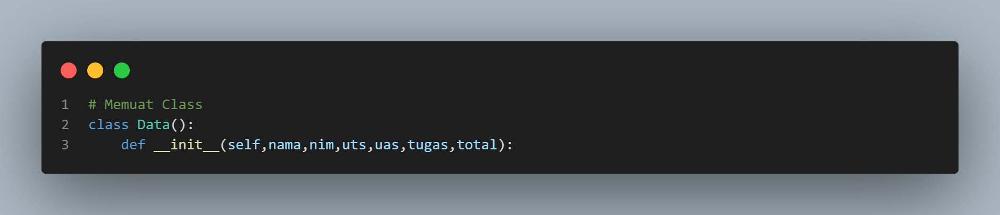
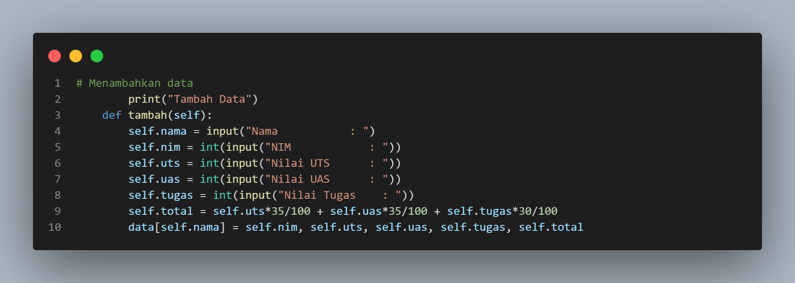
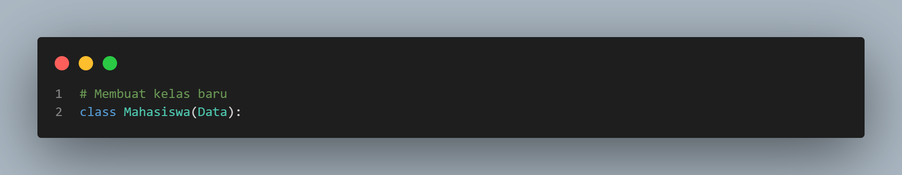
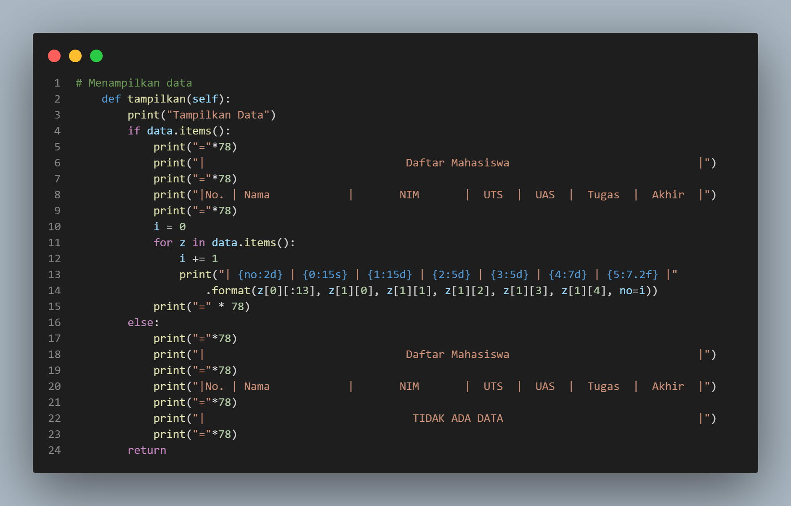
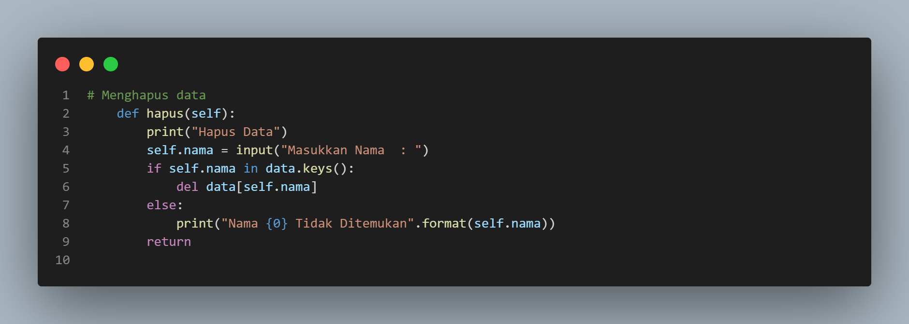
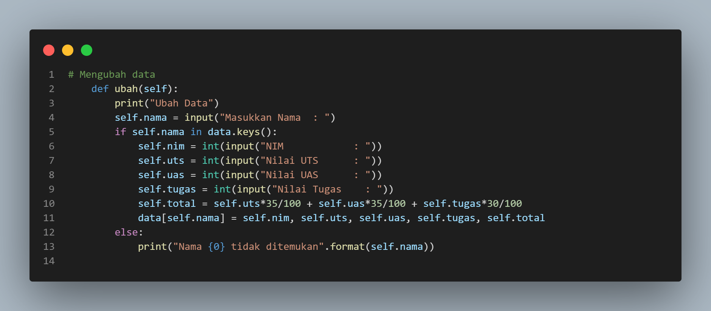
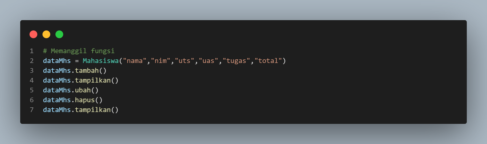

 # PRAKTIKUM 8 ADITYA PUTRA WIJAYA
## Tugas Praktikum
#### Buat program sederhana dengan mengaplikasikan penggunaan class. Buatlah class untuk menampilkan daftar nilai mahasiswa, dengan ketentuan:
• Method tambah() untuk menambah data
• Method tampilkan() untuk menampilkan data
• Method hapus(nama) untuk menghapus data berdasarkan nama
• Method ubah(nama) untuk mengubah data berdasarkan nama
• Langkah pertama membuat dictonary kosong
```
data = {}
```
• Membuat class untuk menampung fungsi pct3

• Fungsi menambahkan data pct4

• Membuat class baru pct5

• Fungsi menampilkan data pct6

• Fungsi menghapus data pct7

• Fungsi Mengubah data pct8

• Code untuk memanggil fungsi pct9


## Output Program
